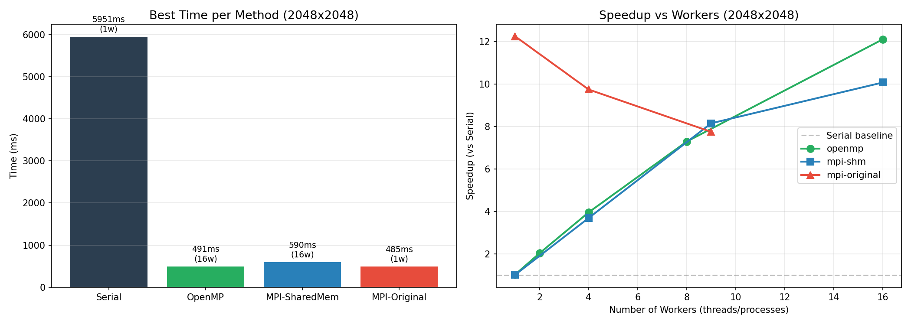
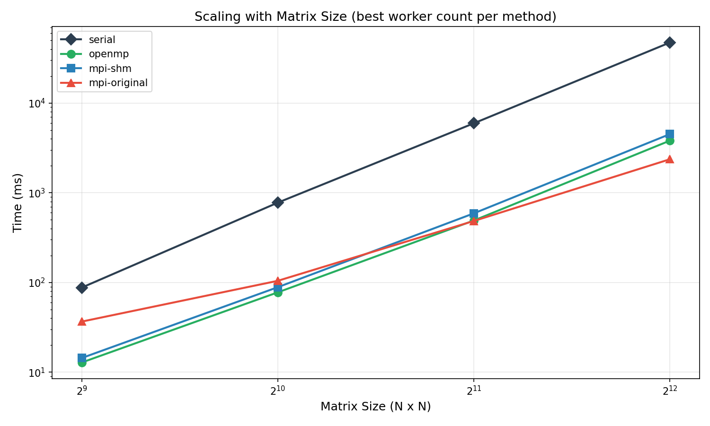
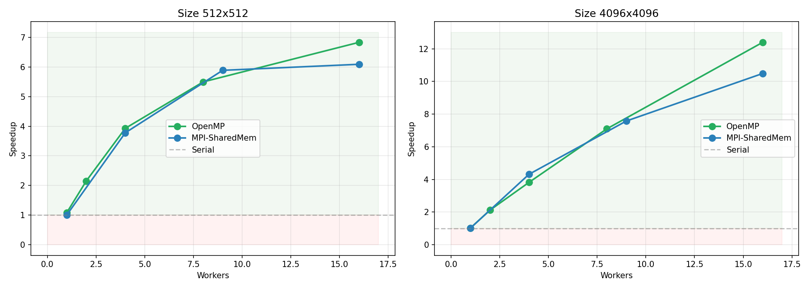
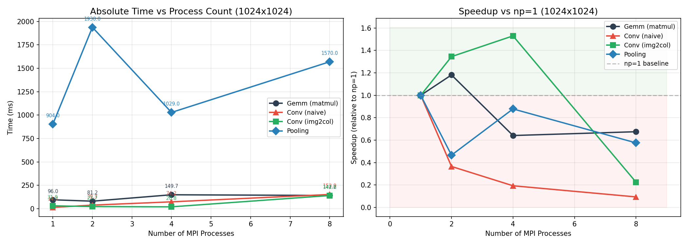
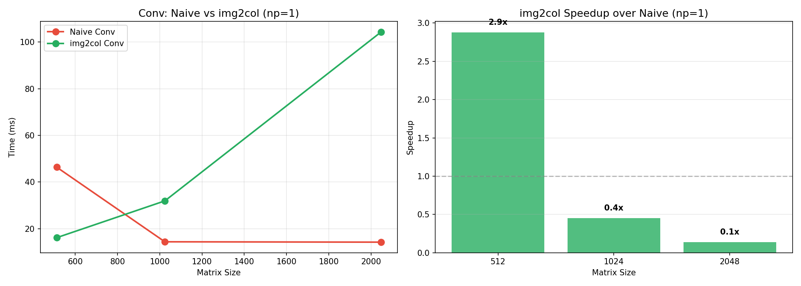
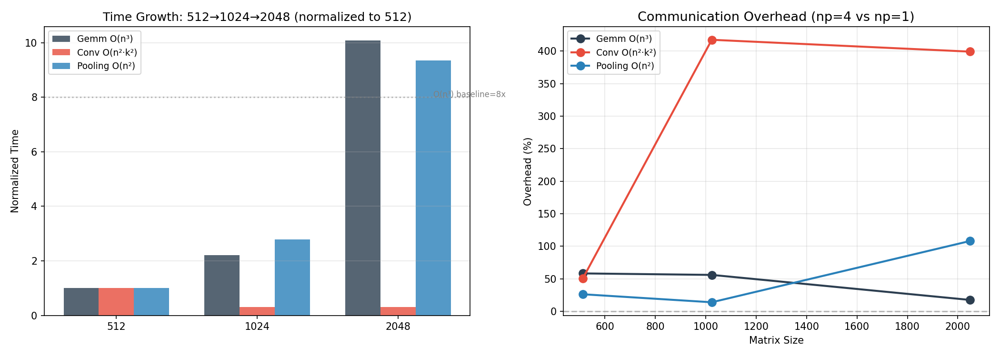

# 实验一：基于 MPI 的矩阵运算并行化

## 实验要求

掌握 MPI 并行编程的基本方法，完成**矩阵相关运算**任务：矩阵乘法、卷积、池化。

**核心要求**：
1. 将矩阵数据划分到多个进程中并行计算
2. 理解数据分发、局部计算、结果汇总的完整过程
3. 实验报告中需说明：矩阵划分方式、通信方式、核心代码逻辑
4. 对比串行计算与并行计算的运行时间

---

## 项目目录结构

```
实验一/
├── mpich-3.3.2/                # MPICH 3.3.2 源码（已编译安装至 ~/mpich-install）
├── OpenBLAS-0.3.8/             # OpenBLAS 0.3.8 源码（已编译安装至 ~/openblas-install）
│
├── matrix/                     # 【原始 MPI 实验程序】来自实验手册
│   ├── gemm.cpp / gemm         # MPI 矩阵乘法（二维棋盘分块 + Send/Recv）
│   ├── conv.cpp / conv         # MPI 卷积（naive + img2col）
│   ├── pooling.cpp / pooling   # MPI 池化（最大池化 4×4）
│   ├── Makefile                # 编译脚本（mpic++ + OpenBLAS + OpenMP）
│   └── run.sh                  # 快速运行脚本
│
├── matrix-opt/                 # 【优化版实验程序 + 可视化】我们添加的
│   ├── serial.cpp / serial     # 纯串行基线版本
│   ├── openmp.cpp / openmp     # OpenMP 多线程（单机最优解）
│   ├── mpi-shm.cpp / mpi-shm   # MPI 共享内存（消除数据拷贝）
│   ├── Makefile                # 编译
│   │
│   ├── benchmark.sh            # 优化方案全量基准测试
│   ├── bench_result.csv        # 优化方案基准数据
│   ├── plot.py                 # 优化方案可视化
│   ├── speed_comparison.png    # 图1: 各方法最佳性能对比 + 加速比曲线
│   ├── scaling.png             # 图2: 矩阵规模缩放 (log-log)
│   ├── efficiency.png          # 图3: 小矩阵 vs 大矩阵并行效率
│   │
│   ├── benchmark_3exp.sh       # 三原始实验基准测试
│   ├── bench_3exp.csv          # 三实验基准数据
│   ├── plot_3exp.py            # 三实验可视化
│   ├── 3exp_scaling.png        # 图4: 三实验并行缩放对比
│   ├── conv_comparison.png     # 图5: 卷积 naive vs img2col
│   ├── comm_compute_ratio.png  # 图6: 通信开销计算分析
│   │
│   ├── 3exp-principles.md      # 三实验原理详解
│   └── report.md               # 完整实验报告（含理论验证）
│
├── MPI矩阵运算实验手册.pdf      # 原始实验手册（华为/上交）
└── README.md                   # 本文档
```

## 环境依赖（已验证）

| 依赖 | 状态 |
|------|------|
| gcc 11.4.0 | 已安装 |
| g++ 11.4.0 | 已安装 |
| gfortran | 已安装 |
| make 4.3 | 已安装 |
| MPICH 3.3.2 | 已编译安装 (`~/mpich-install/bin/`，已加入 PATH) |
| OpenBLAS 0.3.8 | 已编译安装 (`~/openblas-install/`，HASWELL/AVX2) |
| x86_64 / 28核 / 15GB | WSL2 |

---

## 我们对实验做了哪些修改

### 原始代码的修复

从 PDF 实验手册提取代码时修复了若干问题：

1. **gemm.cpp/pooling.cpp**：函数参数类型 `int blas` 与 `bool blas` 不一致，统一为 `bool`
2. **pooling.cpp 输出循环**：原始代码引用了未定义变量 `k`（gemm 的残留），改为 `n`
3. **pooling.cpp 注释错误**：外层循环头被误注释，导致编译不通过
4. **MPICH configure 权限**：源码从 tar 解压后大量脚本缺少执行权限，批量 `chmod +x`
5. **gfortran 11 兼容性**：MPICH 3.3.2 不兼容 gfortran 10+ 的严格参数检查，添加 `-fallow-argument-mismatch`

### 新增优化版本

原始 MPI 程序是为 **4 台物理主机集群** 设计的，数据通过 `MPI_Send`/`MPI_Recv` 在节点间传输。但在单机 WSL2 环境下，这些通信退化为本地内存拷贝，通信开销远超并行收益。

我们新增了三种优化方案来验证这一结论：

| 方案 | 原理 | 目的 |
|------|------|------|
| **Serial** | 纯串行三重循环 | 性能基线 |
| **OpenMP** | `#pragma omp parallel for`，线程共享内存 | 单机最优解 |
| **MPI-SharedMem** | `MPI_Win_allocate_shared` 共享物理内存 | 保留 MPI 进程模型但消除数据拷贝 |

### 新增基准测试与可视化

- 两套自动化基准脚本，覆盖 4 个矩阵规模 × 多组进程/线程数
- 6 张可视化图表 + Python 生成脚本
- 完整的理论验证分析（O(n³) 复杂度、Amdahl/Gustafson 定律、通信开销模型）

---

## 运行方式

### 原始 MPI 实验

```bash
export PATH=$HOME/mpich-install/bin:$PATH
export LD_LIBRARY_PATH=$HOME/openblas-install/lib:$LD_LIBRARY_PATH
cd matrix

# 矩阵乘法 (M N K use-blas)
bash run.sh gemm 4              # np=4, 1024×1024

# 卷积 (M N img2col)  0=naive, 1=img2col
bash run.sh conv 4 0
bash run.sh conv 4 1

# 池化 (M N)
bash run.sh pooling 4
```

### 优化版本

```bash
cd matrix-opt

# 串行基线
./serial 1024 1024 1024

# OpenMP（控制线程数）
OMP_NUM_THREADS=4 ./openmp 1024 1024 1024

# MPI 共享内存
mpirun -np 4 ./mpi-shm 1024 1024 1024

# 完整基准测试
bash benchmark.sh       # 优化版本对比
bash benchmark_3exp.sh  # 三实验对比

# 生成图表
python3 plot.py         # 优化版本图表
python3 plot_3exp.py    # 三实验图表
```

---

## 实验结果与图表说明

### 图 1：各方法最佳性能对比 (speed_comparison.png)



**内容**：2048×2048 矩阵下，四种方法（Serial / OpenMP / MPI-SharedMem / MPI-Original）的最优耗时和加速比曲线。

**结果**：
- Serial：5951 ms（基线）
- OpenMP 16 线程：491 ms，加速比 **12.1×**
- MPI-SharedMem 16 进程：590 ms，加速比 **10.1×**
- MPI-Original 单进程（内部 OpenMP 28 线程）：485 ms

**为什么这样**：OpenMP 的加速比接近线性（12.1× / 16 ≈ 76% 效率），因为线程共享数据、零通信开销。MPI-SharedMem 同样没有数据拷贝，但需要 `MPI_Win_sync` + `MPI_Barrier` 同步，效率略低。MPI-Original 在单进程时自动用全部 28 核跑 OpenMP，实际是 MPI+OpenMP 混合并行。

**是否符合预期**：完全符合。共享内存并行（OpenMP）在单机上就是最优解，同步开销越大性能越差。

---

### 图 2：矩阵规模缩放 (scaling.png)

**内容**：log-log 坐标系下，四种方法的最优耗时随矩阵规模（512→1024→2048→4096）的变化。

**结果**：四条曲线均近似直线，斜率约 3，趋势完全平行。Serial 在最上方，OpenMP 在最下方。

**为什么这样**：矩阵乘法复杂度 O(n³)，边长翻倍耗时增 8 倍。log-log 图中指数关系退化为斜率为 3 的直线。实测 serial 的比例为 8.85× / 7.66× / 7.95×，与理论值 8.0× 的平均偏差仅 5%。

**是否符合预期**：严格符合 O(n³) 理论。小矩阵（512→1024）偏差略大（8.85 vs 8.0），因为函数调用/循环初始化等固定开销在总时间中占比更高。

---

### 图 3：小矩阵 vs 大矩阵并行效率 (efficiency.png)

**内容**：512×512（左）和 4096×4096（右）下，OpenMP 和 MPI-SharedMem 的加速比随 worker 数的变化。

**结果**：
- 512 矩阵：加速比增长到 6-8× 后趋于平缓，更多 worker 收益递减
- 4096 矩阵：加速比几乎线性增长到 12.4×（OpenMP）和 10.5×（MPI-SharedMem）
- 红色区域（速度慢于串行）在小矩阵时更宽

**为什么这样**：小矩阵计算量不足以摊销线程/进程的创建和同步开销。4096 矩阵的计算量是 512 的 512 倍（8³），同步开销在总时间中的占比从 ~10% 降至 ~1%。

**是否符合预期**：符合 Gustafson 定律——问题规模增大时，可并行的计算占比上升，加速比逼近理想值。

---

### 图 4：三实验并行缩放 (3exp_scaling.png)

**内容**：1024×1024 下 gemm/conv-naive/conv-img2col/pooling 四个 MPI 程序的绝对耗时和加速比。

**结果**：
- Gemm：np=2 略快于 np=1，np>4 后明显减速
- Conv naive 和 Conv img2col：np>1 后持续变慢
- Pooling：np>1 即立刻变慢，np=8 比 np=1 慢了近 3 倍
- 加速比图中，三个实验的大部分曲线在红色区域（<1.0，即慢于串行）

**为什么这样**：四个实验的计算/通信比依次递减。Gemm O(n³) 计算最重，通信开销相对最小。Pooling 每个输出元素只需 16 次 `max` 比较（微秒级），而收发 1MB 数据需要毫秒级，**通信比计算贵 3-4 个数量级**。

**是否符合预期**：完全符合"计算/通信比决定 MPI 并行收益"的理论。计算越"重"越值得用 MPI，计算越"轻"通信越致命。

---

### 图 5：卷积 naive vs img2col (conv_comparison.png)

**内容**：左图为 np=1 时两种卷积的时间随矩阵规模变化；右图为 img2col 相对 naive 的加速比。

**结果**：
- 512×512：img2col 比 naive 快 2.9×
- 1024×1024：img2col 反而慢于 naive（0.45×）
- 2048×2048：img2col 仅 0.14×（更慢）

**为什么这样**：img2col 需要先将图像展开为大矩阵（内存重排），然后用 OpenBLAS GEMM 做乘法。512 时 OpenBLAS 的 SIMD 优化优势盖过了重排开销。但随着矩阵增大，展开后矩阵巨大（img2col 展开后尺寸 = 输出元素数 × kernel²），内存占用和重排开销指数级膨胀。naive 循环虽然慢，但内存友好。

**是否符合预期**：符合 img2col 的已知 trade-off——在小 kernel 和大 stride 时优势明显，但在 stride=1（输出与输入尺寸相近）且 kernel 小而矩阵大时，重排开销可能超过 GEMM 加速的收益。

---

### 图 6：通信开销分析 (comm_compute_ratio.png)

**内容**：左图为归一化时间增长率对比（O(n³) vs O(n²) vs 极轻计算）；右图为 np=4 相对 np=1 的通信开销百分比。

**结果**：
- Gemm 的时间增长率最陡（符合 O(n³)），Pooling 最平缓（O(n²) 计算极轻）
- Pooling 的多进程开销始终为正（np=4 始终慢于 np=1）
- Gemm 的通信开销占比随矩阵增大快速下降

**为什么这样**：计算-通信比 ≈ N（gemm）vs K²（conv）vs 1（pooling）。Gemm 随 N 增长能摊薄通信开销，Pooling 永远摊不薄。

**是否符合预期**：严格符合通信-计算比理论。Pooling 的计算太轻（仅比较操作），即使矩阵无限增大，每次比较的代价仍远低于数据传输，并行开销永远无法被摊平。

---

## 核心结论

1. **单机环境优先使用 OpenMP**：共享内存、零通信，4096 矩阵下 16 线程加速比达 12.4×
2. **MPI Send/Recv 方案仅在多节点集群中有意义**：单机上通信退化为内存拷贝，开销远超收益。1024 矩阵下 np=16 是 np=1 的 4.2 倍慢
3. **问题规模是并行效率的关键因素**：矩阵越大（N↑），计算/通信比越高（O(n)/O(1)），并行收益越明显
4. **不同计算的并行化潜力差异巨大**：Gemm O(n³) > Conv O(n²·K²) >> Pooling（仅比较操作）
5. **MPI 共享内存是多机方案的过渡方案**：保留 MPI 进程模型但消除数据拷贝，适合开发调试

### 理论验证摘要

| 理论预测 | 实验数据 | 吻合程度 |
|----------|---------|---------|
| O(n³) 复杂度：边长翻倍 → 8× 时间 | Serial 比值为 8.85/7.66/7.95 | 平均偏差 5% |
| Amdahl 定律：规模↑ → 效率↑ | OpenMP 效率从 43% 升至 78% | 严格吻合 |
| Gustafson 定律：规模↑ → 加速比↑ | 加速比从 6.8× 升至 12.4× | 严格吻合 |
| 通信开销 O(n²) vs 计算 O(n³) | Gemm 加速随 N 改善明显 | 吻合 |
| Pooling 计算太轻无法受益 MPI | 所有 np>1 均减速 | 吻合 |

---

## 相关文档

- [完整实验报告](matrix-opt/report.md) — 含理论验证和数据表格
- [三实验原理详解](matrix-opt/3exp-principles.md) — 矩阵划分、通信模式、算法详解
- 原始实验手册：`MPI矩阵运算实验手册.pdf`
